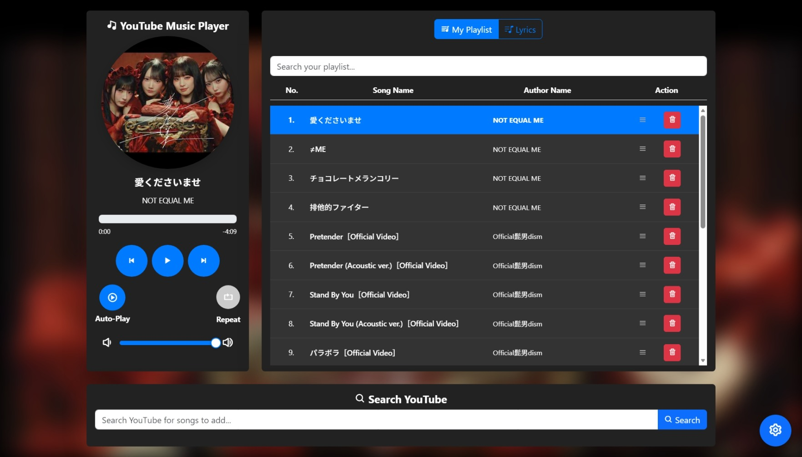
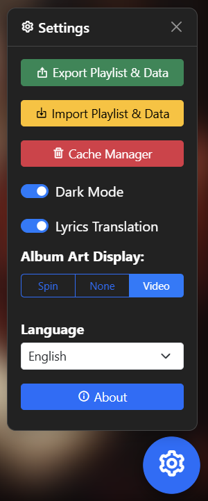

<div align="center">

# YouTube Music Player Web

A responsive YouTube-based music player with playlists, synchronized lyrics, translation, media controls, data import/export, and an optional Android APK wrapper.

[](https://jacob7179.github.io/YouTube-Music-Player-Web/)
[](LICENSE)
[](https://github.com/Jacob7179/YouTube-Music-Player-Web/stargazers)
[](android_build/README-APK.md)

[Live Website](https://jacob7179.github.io/YouTube-Music-Player-Web/) · [Report a Bug](https://github.com/Jacob7179/YouTube-Music-Player-Web/issues) · [Android Build Guide](android_build/README-APK.md)

</div>

> [!WARNING]
> This project is under active development. Some browser, lyrics, translation, and Android background-playback behavior may vary by device or platform.

> [!IMPORTANT]
> This is an independent project and is not affiliated with, endorsed by, or sponsored by YouTube or Google. Playback depends on the YouTube IFrame Player API and requires an internet connection.

## Overview

YouTube Music Player Web turns embedded YouTube videos into a playlist-oriented music player. It runs as a browser application using HTML, CSS, and JavaScript, and it can also be packaged as an Android APK with Capacitor.

The application stores the playlist and most preferences in browser storage, so users can return to their previous setup without creating an account.

## Screenshots

### Main interface



### Settings

<p align="center">
  
</p>

## Features

### Playback and playlist

- Play, pause, seek, previous, next, volume, autoplay, and repeat controls
- Custom playlist with drag-and-drop reordering
- Playlist search and filtering
- Automatic skipping of unavailable videos
- Album-art modes: spinning artwork, static/hidden artwork, or embedded video
- Persistent playlist, volume, display, and playback preferences
- Add a song through a URL parameter:

```text
https://jacob7179.github.io/YouTube-Music-Player-Web/?add_song=YOUTUBE_VIDEO_LINK
```

### YouTube search

- Search YouTube and add results directly to the playlist
- Browser-side search-result caching to reduce repeated API requests
- Cache viewer and cache deletion tools
- Multiple API-key loading methods for GitHub Pages, Vercel, and local development

### Lyrics and translation

- Synchronized and plain lyrics support
- Click a synchronized lyric line to seek to that timestamp
- Per-song lyrics timing offset
- Lyrics translation with cancellation of stale requests when the song changes
- Translation cache and configurable original/translated text order
- Optional background lyrics fetching and translation settings

### Interface and data

- Responsive layout for desktop, tablet, and mobile screens
- Light and dark modes
- Interface languages:
  - English
  - 简体中文
  - 繁體中文
  - 日本語
  - 한국어
- Import and export playlist data and compatible settings as JSON/TXT data
- Adjustable title-scroll speed and spacing
- Scroll-to-top control

### System and Android integration

- Browser Media Session API integration where supported
- Operating-system play, pause, previous, next, seek, metadata, and playback-position controls
- Capacitor Android wrapper with native file picker, filesystem, sharing, and media-session plugins
- Android notification, lock-screen, headset, and background-playback support where the device permits it
- Wired-earphone center-button controls in the patched Android build:
  - 1 tap: play or pause
  - 2 taps: next song
  - 3 taps: previous song

## Technology

| Area | Technology |
|---|---|
| Front end | HTML5, CSS3, JavaScript |
| UI | Bootstrap 5, Bootstrap Icons, Boxicons |
| Playback | YouTube IFrame Player API |
| Search | YouTube Data API v3 |
| Storage | Browser `localStorage` |
| Web deployment | GitHub Pages / Vercel |
| Android | Capacitor 7, Gradle, Java 21, Android SDK 35 |

## Quick Start

### 1. Clone the repository

```bash
git clone https://github.com/Jacob7179/YouTube-Music-Player-Web.git
cd YouTube-Music-Player-Web
```

### 2. Start a local web server

Using Python:

```bash
python -m http.server 8000
```

Then open:

```text
http://localhost:8000
```

Opening `index.html` directly may work for basic playback, but a local HTTP server is recommended because some browser APIs and API endpoints do not work correctly with `file://` URLs.

### 3. Configure YouTube search

Playback and the existing playlist can work without a YouTube Data API key. A key is required for YouTube search and for automatically resolving some video information.

## YouTube Data API Configuration

### Create an API key

1. Open [Google Cloud Console](https://console.cloud.google.com/).
2. Create or select a project.
3. Enable **YouTube Data API v3**.
4. Create an API key.
5. Restrict the key to **YouTube Data API v3**.
6. Add an application restriction appropriate for the deployment, such as HTTP referrers for a website.

### Option A: GitHub Pages

The included workflow deploys the site when changes are pushed to `main`.

1. Open the GitHub repository.
2. Go to **Settings → Secrets and variables → Actions**.
3. Create a repository secret named:

```text
YOUTUBE_API_KEY
```

4. Push to `main`, or run the workflow manually from the **Actions** page.

The workflow in `.github/workflows/deploy.yml` copies the deployable files, injects the value into the deployment copy of `script.js`, uploads the Pages artifact, and deploys it.

> [!CAUTION]
> GitHub Secrets prevent the key from being committed to the repository, but a key injected into browser JavaScript is still visible to website visitors through developer tools and network requests. Use strict API restrictions and quota limits. For stronger protection, send search requests through a server-side proxy that never returns the key to the browser.

### Option B: Vercel

The project includes `api/getApiKey.js`, which reads `YOUTUBE_API_KEY` from the Vercel environment.

1. Import the repository into Vercel.
2. Add an environment variable named `YOUTUBE_API_KEY`.
3. Redeploy the project.

The current endpoint returns the key to the browser, so the same client-side visibility warning applies. A secure production design should proxy YouTube API requests on the server instead of returning the key.

### Option C: Local direct key

For temporary local testing, replace this line in `script.js`:

```javascript
const YOUTUBE_API_KEY = "YOUR_YOUTUBE_API_KEY";
```

Do not commit a real key to Git.

### Current key-resolution order

`script.js` attempts to obtain a key in this order:

1. Key injected directly into `script.js`
2. `/api/getApiKey`
3. Configured Cloudflare Worker fallback

## Deployment

### GitHub Pages

The repository already contains `.github/workflows/deploy.yml`.

Before the first deployment:

1. Add the `YOUTUBE_API_KEY` repository secret.
2. In **Settings → Pages**, select **GitHub Actions** as the source.
3. Push to `main` or manually run the deployment workflow.

### Vercel

The root folder can be deployed as a static site. The `api` folder is automatically treated as a serverless function directory by Vercel.

Set `YOUTUBE_API_KEY` in the Vercel project environment before deployment.

## Android APK

The `android_build` folder contains a Capacitor wrapper and a Windows build script.

### Automatic Windows build

```powershell
cd android_build
.\build.bat
```

The script prepares portable Node.js, Java JDK 21, and Android SDK 35 tools when required, synchronizes Capacitor, applies the Android media-session patches, and builds a debug APK.

Generated APK:

```text
android_build/android/app/build/outputs/apk/debug/app-debug.apk
```

See [android_build/README-APK.md](android_build/README-APK.md) for:

- Complete requirements and build behavior
- Quick rebuild commands
- ADB installation
- Android icons and splash resources
- Native import/export
- Background playback
- Media controls and earphone multi-click behavior
- Common Gradle, Java, and Android SDK errors

## Usage

1. Select a song from the playlist.
2. Use the player controls to play, pause, seek, change volume, or switch tracks.
3. Search YouTube and add a result to the playlist.
4. Drag playlist items to reorder them.
5. Open **Settings** to change language, appearance, album-art mode, lyrics behavior, translation, and title animation.
6. Export the playlist and settings before clearing browser storage or changing devices.
7. Import a previous export to restore compatible data.

## Advanced Console Commands

Open the browser developer console to use these optional commands.

### Adjust the current song's lyric timing

```javascript
setCurrentSongLyricsTimeOffset(0.75);
```

Positive values delay the displayed lyrics. Negative values show them earlier. The offset is saved in that song's playlist data.

### Adjust title spacing

```javascript
setTitleGapFraction(0.3);
```

### Adjust title scrolling speed

```javascript
setTitleScrollSpeed(50);
```

## Data Storage

The app stores data locally in the browser, including:

- Playlist and per-song lyric offsets
- Search cache
- Lyrics and translation caches
- Language and dark-mode preferences
- Volume, autoplay, and repeat settings
- Album-art mode
- Lyrics and translation options
- Title animation settings

Clearing site data or browser storage removes local data unless it has been exported first.

## Project Structure

```text
YouTube-Music-Player-Web/
├─ .github/
│  └─ workflows/
│     └─ deploy.yml                 GitHub Pages deployment
├─ alpha/                           Experimental API-key version
├─ android_build/                   Capacitor Android wrapper
│  ├─ build.bat                     Automated Windows APK build
│  ├─ clean.bat                     Generated-folder cleanup
│  ├─ capacitor.config.json         Capacitor application settings
│  ├─ package.json                  Android dependencies and scripts
│  └─ README-APK.md                 Detailed Android documentation
├─ api/
│  └─ getApiKey.js                  Vercel API-key endpoint
├─ beta/                            Experimental file-reading version
├─ resource/                        Screenshots, icons, and sample exports
├─ 404.html                         GitHub Pages fallback page
├─ index.html                       Main interface
├─ script.js                        Player, playlist, lyrics, search, and settings
├─ style.css                        Responsive styling and animations
├─ LICENSE                          AGPL-3.0 license
└─ README.md                        Project documentation
```

## Troubleshooting

### YouTube search says the API key is not configured

- Confirm the environment variable or GitHub secret is named exactly `YOUTUBE_API_KEY`.
- Redeploy after adding or changing the key.
- Check the browser console and network panel for failures from `getApiKey` or the YouTube API.
- Confirm YouTube Data API v3 is enabled in the Google Cloud project.
- Check API restrictions and quota usage.

### Playback works but search does not

Playback uses the YouTube IFrame Player API, while search uses YouTube Data API v3. These are separate services; search requires a valid Data API key.

### Lyrics or translation do not load

- Confirm the device has internet access.
- Try another song title or author because external lyrics services may not have a matching record.
- Disable browser extensions that block translation, lyrics, proxy, or advertising-related network requests.
- Open the browser console to identify blocked CORS or rate-limit responses.

### Android playback stops in the background

- Install an APK produced by the latest `build.bat`.
- Grant notification permission on Android 13 or later.
- Set the app's battery mode to **Unrestricted** when required by the device manufacturer.
- Do not force-stop the app.

Because playback still uses an embedded YouTube web player, some Android versions or manufacturers may stop the WebView after the app is removed from recent apps.

## Security and Privacy

- Playlist and preference data are stored locally in the user's browser unless exported or shared manually.
- YouTube, lyrics, translation, CDN, proxy, and hosting services receive network requests required for their features.
- Do not treat a browser-delivered API key as a secret.
- Restrict keys by API, website referrer, quota, and deployment environment.
- Do not commit credentials, private exports, generated signing keys, or local Android tool folders.

## Contributing

Bug reports, suggestions, and pull requests are welcome.

1. Fork the repository.
2. Create a feature branch.
3. Test the web version and, when relevant, the Android build.
4. Submit a pull request with a clear description of the change.

Use the [issue tracker](https://github.com/Jacob7179/YouTube-Music-Player-Web/issues) for reproducible bugs and feature requests.

## Contributors

<table>
  <tbody>
    <tr>
      <td align="center" valign="top" width="160">
        <a href="https://github.com/Jacob7179">
          <br>
          <sub><strong>Jacob7179</strong></sub>
        </a>
      </td>
      <td align="center" valign="top" width="160">
        <a href="https://github.com/Farwalker3">
          <br>
          <sub><strong>Farwalker3</strong></sub>
        </a>
      </td>
    </tr>
  </tbody>
</table>

## License

This project is licensed under the [GNU Affero General Public License v3.0](LICENSE).
