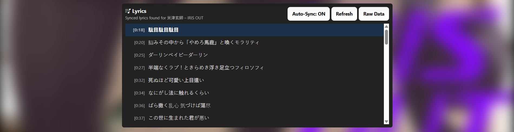
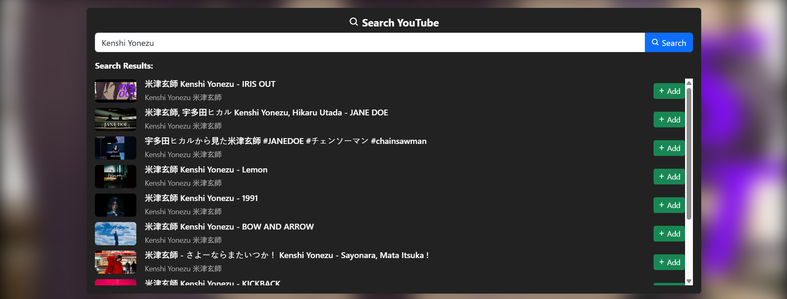
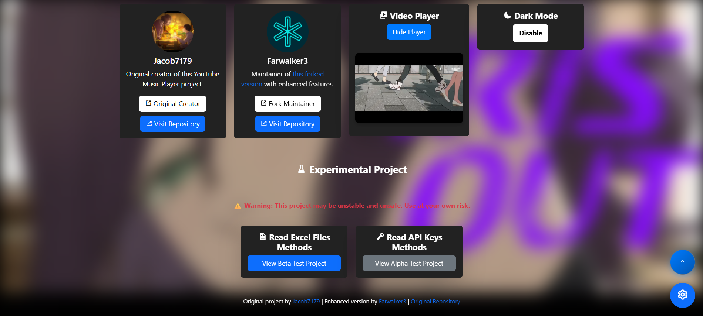
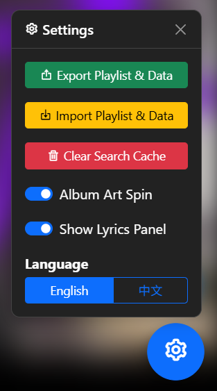

<h1 align="center">YouTube Music Player Web</h1>

> [!WARNING]
> **This project is in the testing stage and some features may be unstable and unsafe. Use at your own risk.**

> [!NOTE]
> **The project was developed using HTML, CSS, JavaScript language and [YouTube Iframe Player API](https://developers.google.com/youtube/iframe_api_reference).**

## Screenshots

## Information

This project is a **YouTube Music Player Web Application** that allows users to stream and control YouTube videos as an interactive music player. It features a custom playlist, enabling users to select and play songs seamlessly. The app includes auto-play, repeat mode, and volume control, along with a progress bar for tracking playback. Additionally, a dark mode toggle enhances user experience. The interface is styled using Bootstrap and custom CSS animations, while JavaScript manages the YouTube IFrame API for video playback. The app also dynamically updates the background image based on the selected song, creating a visually engaging experience.

The player in this project is created using the **YouTube IFrame API**, which allows embedding and controlling YouTube videos through JavaScript.

## 🚀 Setup Instructions

### YouTube Search Functionality (GitHub Secrets Method - Recommended)

For secure API key management, this project uses GitHub Secrets:

1. **Get a YouTube Data API Key**:
   - Go to the [Google Cloud Console](https://console.cloud.google.com/)
   - Create a new project or select an existing one
   - Enable the **YouTube Data API v3**
   - Create credentials (API key)
   - Restrict the API key to YouTube Data API v3 for security

2. **Add Your API Key to GitHub Secrets**:
   - Go to your repository on GitHub
   - Click on **Settings** → **Secrets and variables** → **Actions**
   - Click **New repository secret**
   - Name: `YOUTUBE_API_KEY`
   - Value: Your actual YouTube Data API key
   - Click **Add secret**

3. **Deploy**:
   - The GitHub Actions workflow will automatically inject your API key during deployment
   - Push any changes to the `main` branch to trigger a new deployment
   - Your API key remains secure and is never exposed in your code

### Alternative: Local Development Setup

For local development, you can still manually add the API key:

1. **Clone the repository locally**
2. **Create `config.js` files**
3. **Insert**: `const YOUTUBE_API_KEY = 'YOUR_YOUTUBE_API_KEY';`
4. **Replace** `'YOUR_YOUTUBE_API_KEY'` with your actual API key
5. **Important**: Never commit this change to prevent exposing your API key

### API Usage Information

- **Daily Quotas**: The YouTube Data API has daily quotas
- **Search Requests**: Each search consumes quota units
- **Free Tier**: Should be sufficient for personal use
- **Rate Limiting**: The app includes error handling for API limits

### Without API Key

If you don't want to set up the YouTube API, you can still:
- Use the existing default playlist
- Manually add songs by editing the `playlist` array in `script.js`
- Search and filter your existing playlist

## 🎵 How to Use

1. **Playing Songs**: Click on any song in your playlist to play it
2. **Search YouTube**: Use the search bar to find new songs on YouTube
3. **Add Songs**: Click the "Add" button next to search results to add them to your playlist
4. **Persistent Playlist**: Your playlist is saved in browser storage and persists across sessions
5. **Remove Songs**: Click the trash icon next to songs in your playlist to remove them
6. **Search Playlist**: Use the playlist search bar to filter your existing songs
7. **Controls**: Use play/pause, next/previous, volume, and repeat controls
8. **Dark Mode**: Toggle dark mode for better viewing experience
9. **Lyrics**: Toggle to view the song’s lyrics
10. **Language**: Languages available: English, 中文
11. **Secure API Key Management**: Uses GitHub Secrets for secure API key storage
12. **Optimized Search**: Searched result will store in browser storage (No need to waste Quota for same results)
13. **Import Playlist & Data**: Import playlist and data (Dark mode, Album Art spin settings & Lyrics settings) with JSON files
14. **Export Playlist & Data**: Export playlist and data (Dark mode, Album Art spin settings & Lyrics settings) as JSON files
15. **Album Art Spin Toggle**: Toggle Album Art Spin option to enable or disable album art spinning
16. **Delete Search Cache**: Delete search cache from browser storage

## 🔧 GitHub Actions Workflow

This project uses GitHub Actions to:
- **Securely inject** the YouTube API key from GitHub Secrets
- **Automatically deploy** to GitHub Pages on every push to main
- **Keep your API key safe** by never exposing it in the repository

The workflow file is located at `.github/workflows/deploy.yml`.

## 📁 Project Structure

- `index.html` - Main application interface
- `script.js` - Core functionality and YouTube integration
- `style.css` - Styling and animations
- `.github/workflows/deploy.yml` - GitHub Actions deployment workflow
- `README.md` - This documentation
- `/beta/index.html` - Read Excel Files Methods Version (Experimental Project)
- `/alpha/index.html` - Read Api Keys Methods Version (Experimental Project)
- `/resource` - Source of the project (Image, Files, Icon & Export data version)

## 🔐 Security Features

- **GitHub Secrets**: API keys are stored securely in GitHub Secrets
- **No Key Exposure**: API keys are never committed to the repository
- **Automatic Injection**: Keys are injected during deployment only (But you can found api keys declaration on website [config.js])
- **Restricted API Keys**: Recommended to restrict API keys to specific services

## 🤝 Attribution

- **Original Creator**: [Jacob7179](https://github.com/Jacob7179) - Created the base YouTube Music Player
- **Original Repository**: [Jacob7179/YouTube-Music-Player-Web](https://github.com/Jacob7179/YouTube-Music-Player-Web)
- **Fork Maintainer**: [Farwalker3](https://github.com/Farwalker3) - Added enhanced features and YouTube search

## 📄 License

## 🌐 Website

## 🐛 Issues & Contributions

If you encounter any issues or have suggestions for improvements:
- Check the [original repository](https://github.com/Jacob7179/YouTube-Music-Player-Web) for base functionality issues
- Open issues in this fork for enhanced features
- Contributions are welcome via pull requests

## 🔧 Development

To run this project locally:
1. Clone the repository
2. Set up your YouTube Data API key (see setup instructions above)
3. Open `index.html` in a web browser
4. The app works entirely client-side, no server required

For production deployment:
1. Set up the `YOUTUBE_API_KEY` secret in your GitHub repository
2. Push to the `main` branch
3. GitHub Actions will handle the rest!

## Contributors

<table>
    <tbody>
        <tr>
            <td align="center" valign="top" width="14.28%"><a href="https://github.com/Jacob7179.png"> <b>Jacob7179</b></a></td>
            <td align="center" valign="top" width="14.28%"><a href="https://github.com/Farwalker3.png"> <b>Farwalker3</b></a></td>
        </tr>
    </tbody>
</table>

---
*This project builds upon the excellent work of [Jacob7179](https://github.com/Jacob7179). Thanks for creating such a solid foundation!*